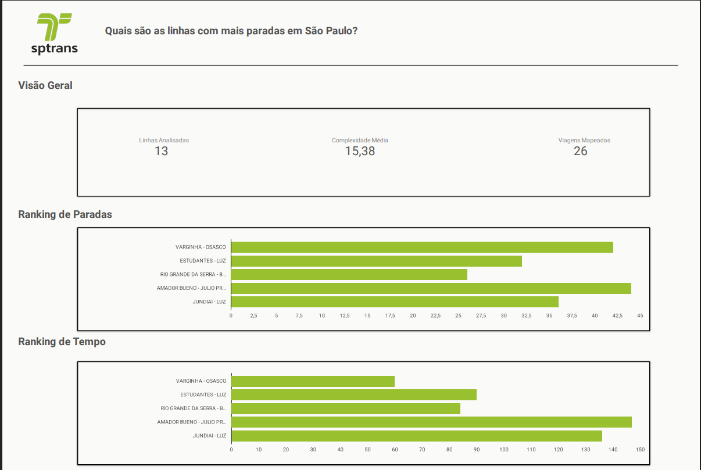

# 🚌Otimização da Mobilidade Urbana - SPTrans
Este projeto realiza uma análise exploratória de dados (EDA) sobre o sistema de transporte público de São Paulo, utilizando os dados oficiais da SPTrans (formato GTFS). O objetivo é identificar as linhas mais complexas em termos de paradas e o impacto disso no tempo total de viagem.

## 📊Principais Insights do Dashboard
A análise revelou que nem sempre a quantidade de paradas dita a demora de uma linha:

* Ranking de Paradas: A linha AMADOR BUENO - JULIO PRESTES lidera em complexidade operacional com aproximadamente 44 paradas por viagem.
* Ranking de Tempo: A mesma linha (AMADOR BUENO - JULIO PRESTES) gasta cerca de 147 minutos para completar o trajeto, sendo a mais demorada da amostra.
* Eficiência: Linhas como JUNDIAI - LUZ mostram um tempo elevado (~136 min) apesar de possuírem menos paradas que as linhas de metrô, evidenciando grandes distâncias entre estações.

## 🛠️Tecnologias Utilizadas

* Python: Processamento e limpeza de dados com a biblioteca pandas.
* Google Looker Studio: Visualização de dados e criação de dashboards interativos.
* Dados GTFS: Arquivos oficiais da SPTrans (Agosto/2025).

## 📂Estrutura do Repositório

* analise_sptrans.py: Script Python que calcula a densidade de paradas e converte horários de chegada/partida em minutos totais de viagem.
* dados_para_looker.csv: Base de dados tratada e exportada pelo Python para alimentar o dashboard.
* Relatorios/: Contém o arquivo SPTrans.pdf com a visualização final do projeto.

## 📈Resultados Estatísticos

* Linhas Analisadas: 13
* Viagens Mapeadas: 26
* Complexidade Média: 15,38 paradas por linha.
* Correlação (Paradas vs Tempo): 0.51 (Indica que o número de paradas explica apenas 50% da demora; os outros 50% são tráfego e distância).

## 📊 Dashboards e Visualização
Abaixo, a comparação entre a densidade de paradas e o tempo de deslocamento:

*O gráfico acima demonstra que a linha **Amador Bueno - Julio Prestes** lidera tanto em paradas quanto em tempo total de viagem (147 min).*

## 🏁Conclusão
Este projeto foi desenvolvido para demonstrar minha capacidade de transformar dados brutos de transporte (GTFS) em insights estratégicos de mobilidade. Através do tratamento de dados com Python, consegui ir além da simples contagem de paradas e isolei gargalos temporais que impactam diretamente a jornada do usuário. A análise me permitiu concluir que, embora a linha Amador Bueno - Julio Prestes possua a maior complexidade operacional, a eficiência do sistema é multifatorial, dependendo da relação entre densidade de paradas e velocidade média do trajeto.

## 📩Contato
Gostou do projeto? Vamos conectar! Estou em busca de novas oportunidades e desafios na área de dados.

* **LinkedIn**: [Gabriel Araujo](https://www.linkedin.com/in/gabriel-araujo-a99a833a4/)
* **Email**: [gabrielaraujobr99@gmail.com](mailto:gabrielaraujobr99@gmail.com)
* **GitHub**: [gabrielaraujobr99](https://github.com/gabrielaraujobr99)
